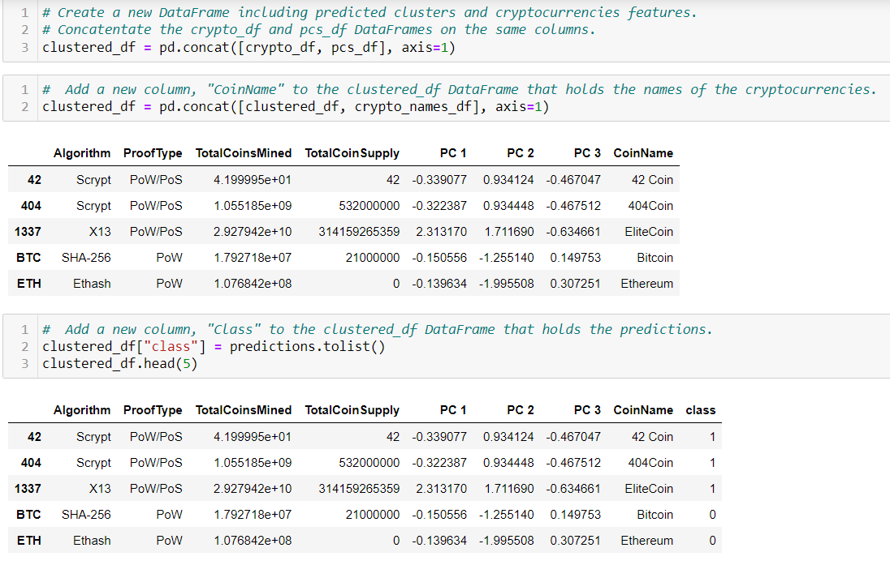

# Cryptocurrencies Unsupervised Machine Learning

## Overview 
 Accountability Accounting, a prominent investment bank, is interested in offering a new cryptocurrency investment portfolio for its customers. The purpose of this project was to create a report that includes what cryptocurrencies are on the trading market and how they could be grouped to create a classification system for this new investment.

 The data is not ideal, so it will need to be processed to fit the machine learning models. Since there is no known output for this analysis, unsupervised learning will be used. 
 
 Here are the steps used for the report:
 1. Use Pandas to preprocess the Data to get it ready for PCA
 2. Use PCA to reduce data dimensions
 3. Group the cryptocurrencies by using the K-means clustering algorithm 
 4. Create scatter plots to visualize the groups

## Results

Deliverable 1: Preprocessing the Data for PCA 
* The file "crypto_data.csv" was read into a pandas dataframe
* Only rows were kept where "IsTrading" ==True

* The "IsTrading" Column was dropped along with any rows that had a null value and/or where "TotalCoinsMined" <=0

* "CoinName" was held in a separate DataFrame and dropped from the main DataFrame

* Get_dummies and StandardScalar was used

 

Deliverable 2: Reducing Data Dimensions Using PCA
* PCA was used to reduce to 3 principal components and then create a new DataFrame

Deliverable 3: Clustering Cryptocurrencies Using K-means
* An elbow curve was created to find the best value for K

* Since k=4 was obvious was the elbow curve, a model fitted and used to make predictions

* A new DataFrame was created by merging "crypto_df", "pcs_df", and the classes created by using the predictions

  

Deliverable 4: Visualizing Cryptocurrencies Results
* A 3D-Scatter created with the PCA data and the clusters

* A hvplot.scatter plot (2D) was created using x="TotalCoinsMined" and y="TotalCoinSupply".

